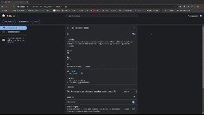

# Website Blocker Chrome Extension

This Chrome extension allows users to block and manage websites by adding, editing, or deleting URLs through a user-friendly interface. It features enable/disable functionality and real-time synchronization using React and TypeScript.
- Block specific websites by adding their URLs.
- Edit or delete existing blocked URLs.
- Enable or disable the website blocker functionality.
- User-friendly interface built with React and TypeScript.
- Real-time synchronization with Chrome's local storage.

## Demo



## Installation

- Clone the repository to your local machine:
```sh
git clone https://github.com/divyansh2209/Chrome-tab-blocker.git
cd website-blocker-extension
```
- Install the dependencies:
```sh
npm install

```
- Build the project:
```sh
npm run build
```

## Load the Extension in Chrome
- Open Chrome and navigate to chrome://extensions/.
- Enable "Developer mode" in the top right corner.
- Click on "Load unpacked" and select the dist folder from the project directory.

## Usage
- Click on the extension icon in the Chrome toolbar.
- Use the input field to add new websites to block. Click "Add" to save the URL.
- View the list of blocked websites. Use the edit (✏️) and delete (⛔) buttons to manage the URLs.
- Use the checkbox to enable or disable the website blocker functionality.
## License

[MIT](https://choosealicense.com/licenses/mit/)

